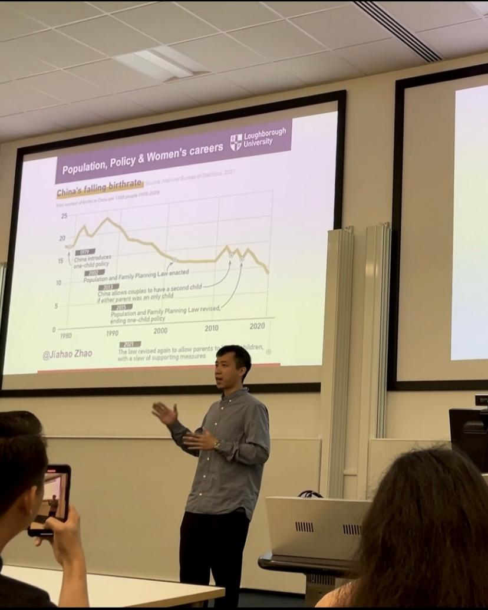

<h1 id="about-me"></h1>

<h2 style="margin: 60px 0px 10px;">Short Bio</h2>

<!-- I am currently a Physics Ph.D. candidate at [Spin-Ion Technologies](https://www.spin-ion.com/) and [Université Paris-Saclay](https://www.universite-paris-saclay.fr/), working under the mentorship of Dr. [Ravelosona dafiné](https://www.spin-ion.com/about-us/), the director of research [CNRS](https://www.cnrs.fr/fr) and CTO of [Spin-Ion Technologies](https://www.spin-ion.com/). -->

I recently completed my PhD at [Loughborough University](https://www.lboro.ac.uk/), where my research examined how State-regulated family planning policies –the three-child policy in China in my work– shape working women's career experiences, fertility decisions and everyday life in internet communication and technology (ICT) sector. Drawing on qualitative approaches, my research speaks to broader debates in human resource management, social policy, gender and work, and the sociology of reproduction. 

I am particularly interested in how macro-level events (e.g., public policy, cultural shifts, and social event) contribute to gender (in)equality by influencing organisations, family and individual’s experiences (e.g., right, belief, values, preference and choices). I am currently on the academic job market, seeking lecturer and postdoctoral positions or any other potential research project in areas related to sociology, gender and employment and public policy. **Feel free to reach out to me to explore any potential collaboration opportunities!**

## Research Interest

- **Gender, work and organisation**
- **Social policy, especially family planning/reproductive policy**
- **Feminist and critical perspectives on careers**
- **Masculinity and changing gender norms**
- **Multi-level theory-based analysis**
- **Race, migration, class and mobility**
- **Human resource management**

## Education
- **PhD in Business and Management**, [Loughborough University](https://www.lboro.ac.uk/), UK, 2021-2025
- **MA Human Resource and Consulting**, [Lancaster University](https://www.lancaster.ac.uk/), UK, 2018-2019
- **BSc Human Resource Management**, [South China Agricultural University](https://scau.edu.cn/), China, 2014-2018

## Teaching

I have teaching experience as a seminar tutor and teaching assistant at [Loughborough University](https://www.lboro.ac.uk/), contributing to undergraduate and postgraduate modules in:

- **Human Resource Management**
- **Qualitative Research Methods**
- **Career Planning**
- **Corporate Social Responsibility** (exam marking)

In these roles I have facilitated seminar discussions, supported students' coursework and research projects, and gained extensive experience in qualitative research design and supervision.

## Experience

Before entering academia, I worked in the business sector as a human resource professional. I served as an HR intern at DJI, a drone company, and as a management trainee at Costa. These work experiences have provided me with a solid foundation for understanding the tangible impacts of business environments and public policy, while also offering valuable insights for exploring intersecting topics such as gender, policy, work, and organisational dynamics.

## Funding

- **£28800 – China Scholarship Council & [Loughborough University](https://www.lboro.ac.uk/) Joint Doctoral Scholarship** (2022-2024)

  Fully funded my PhD research at [Loughborough University](https://www.lboro.ac.uk/) on my PhD work, covered the PhD tuition fees and provided a monthly stipend.

- **£300 – Open Research Council (ORC) small grant** (2022)

  Supported the dissemination of my doctoral research and the promotion of open research practices.

- **£4,000 – [Lancaster University](https://www.lancaster.ac.uk/) Merit Scholarship** (2019)

  Awarded for academic performance during my MA in Human Resource and Consulting at [Lancaster University](https://www.lancaster.ac.uk/).

- **Honorary award – Outstanding Student Cadre of Guangdong Province** (2017)

  Provincial-level recognition for and student leadership during my undergraduate studies at [South China Agricultural University](https://scau.edu.cn/).

## Publications

- **PhD thesis: [Analysis of Working Women's Perceptions of State-regulated Family Planning Policy: China as a Case Study](https://www.researchgate.net/publication/398493697_Analysis_of_working_women%27s_perceptions_of_state-regulated_family_planning_policy_China_as_a_case_study?channel=doi&linkId=693852469aa6b4649dbeac24&showFulltext=true) (December 2025)**

  This doctoral thesis examines how China's one-, two- and three-child policies shape working women's reproductive decisions and career trajectories, with a particular focus on the ICT sector and related male-dominated industries. Drawing on 44 in-depth semi-structured interviews and a social constructivist, multi-level (macro–meso–micro) framework. It identifies four overarching themes - reproductive autonomy and societal dynamics, socio-economic pressures, workplace environment and HR policy, and cultural expectations and gender equality - and develops an expanded conceptual model to understand policy–career linkages in contemporary China.

- **Journal paper: From the three-child policy to fertility rates: Analysing macro–micro–macro processes via the bathtub model (in preparation).**

  This paper uses Coleman's bathtub model to trace how China's three-child policy shapes women's lived experiences of motherhood, career and family life, and how these micro-level processes aggregate into persistent low fertility rates. It extends the original model by adding organisational and feedback pathways to better capture the dynamics of fertility policy and outcomes.

- **Journal paper: "The more reproductive freedom, the more reproductive pressure": Perceived consequences of the three-child policy on women's careers in China, *Work, Employment and Society* (under peer review, August 2025).**

  Based on in-depth interviews with working women across urban China, this article identifies diverse perceptions of the three-child policy and shows how "greater reproductive freedom" can paradoxically intensify expectations that women shoulder care responsibilities, generating heightened career instability and uncertainty.

- **Conference paper: [Multi-level Influences on Women's Careers under China's Family Planning Policy — A Literature Review](https://www.researchgate.net/profile/Jiahao-Zhao-11/publication/395332709_Multi-level_Influences_on_Women's_Careers_under_China's_Family_Planning_Policy--A_Literature_Review/links/68bcc15d6fe8e57ec8e2f7de/Multi-level-Influences-on-Womens-Careers-under-Chinas-Family-Planning-Policy--A-Literature-Review.pdf), paper presented at the British Academy of Management (BAM) Annual Conference 2022, Manchester, UK.**

  This review maps how family planning policy shapes women's careers at macro (state), meso (organisation) and micro (family/individual) levels and calls for genuinely multi-level, context-sensitive analyses of Chinese women's career development under shifting fertility regimes.

- **Journal paper: [Exploring the Direct and Indirect Effects of Emotional Leadership on Entrepreneurial Success of Start-ups in the Hospitality Sector (I) & (II)](https://www.researchgate.net/publication/354128586_Exploring_the_Direct_and_Indirect_Effects_of_Emotional_Leadership_on_Entrepreneurial_Success_of_Start-ups_in_the_Hospitality_Sector_I), *Asia-Pacific Journal of Humanities and Social Sciences*, 2019, 1(2), 001–039.**

  These companion papers conceptualise emotional leadership in hospitality start-ups via empathy, self-confidence and adaptability, and examine how these dimensions influence entrepreneurs' psychological states, employee relations and overall business performance.

- **Journal paper (in Mandarin): [农业企业人力资源现状与管理对策](https://www.researchgate.net/profile/Jiahao-Zhao-11/publication/358756210_Status_and_Countermeasures_of_Human_Resources_Management_in_Agricultural_Enterprises_nongyeqiyerenliziyuanxianzhuangyuguanliduice/links/621431de08bee946f395994f/Status-and-Countermeasures-of-Human-Resources-Management-in-Agricultural-Enterprises-nongyeqiyerenliziyuanxianzhuangyuguanliduice.pdf) [Status and countermeasures of human resources management in agricultural enterprises], *企业改革与管理* (Enterprise Reform and Management), 2017(5, Part 2).**

  This article analyses the human resource challenges facing Chinese agricultural enterprises and proposes strategies to improve recruitment, training, performance appraisal and reward systems in the context of rural transformation and labour mobility.

## Upcoming

- Preparing new publications based on my doctoral research. Concurrently, my recent research interest has also focused on the impact of artificial intelligence on gender inequality (power, algorithms, and knowledge sharing), alongside topics including the shaping, construction, and (re)production of masculinity in public spaces, and the sociology of luck.

- Exploring opportunities to join interdisciplinary projects on gender (in)equality, social policy, critical feminism, masculinity construction and boarder relevant topic of sociology.

- Open to invitations for guest talks, seminars and collaborative research on gender, work and social policy – feel free to contact me.

